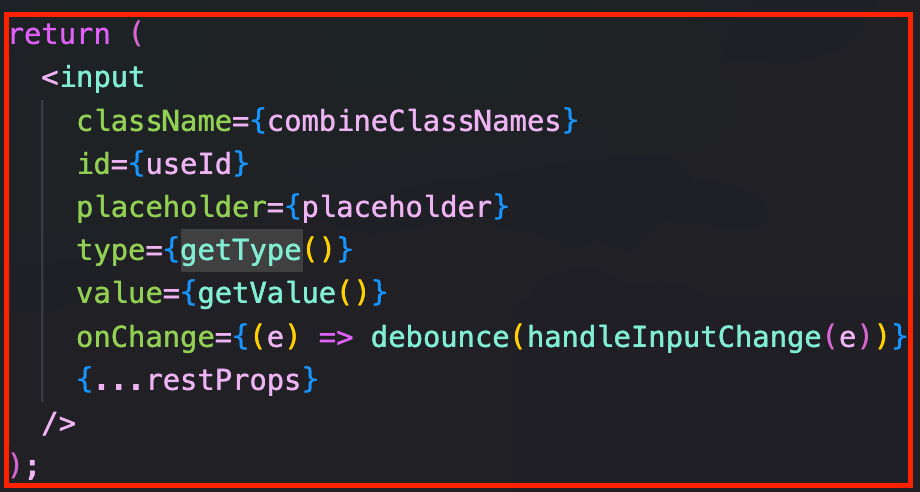
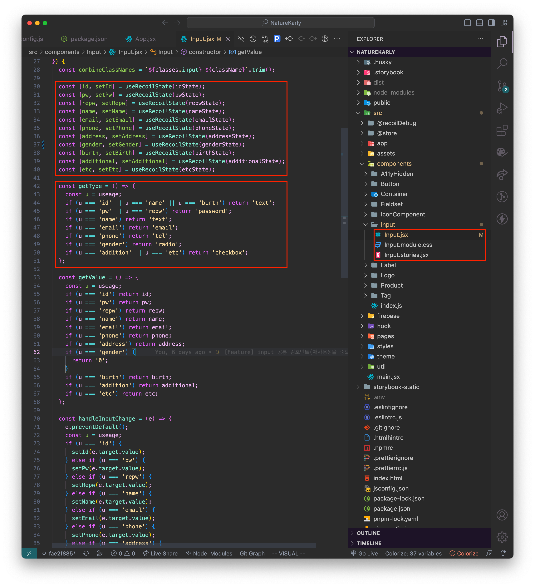
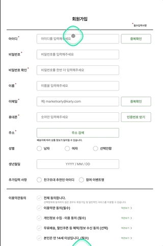
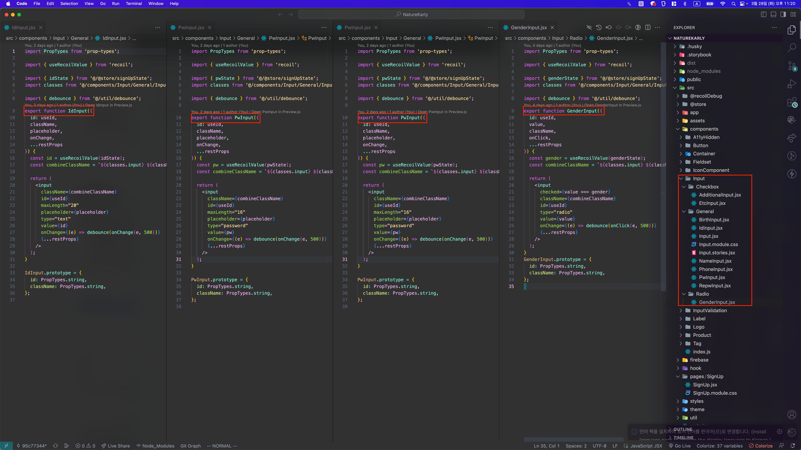
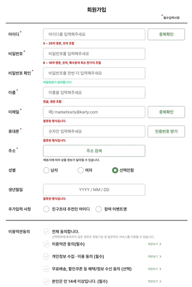

## ✓ 시작하기 전에

 React의 선언적인 데이터 관리, 단방향 데이터 흐름, state & props를 통해서 Stateless Component, Stateful Component의 개념은 알고 있었지만, 이것의 디자인패턴에 관한 사실은 알고 있지는 않았다.  

 Flux 패턴을 공부하기전에 어떻게 컴포넌트 역할을 나눌지에 관하여 Container-Presenter Pattern을 정리하고 가는게 좋을 것 같아 보였다.  

---

## 1. Presentational Component란
- 시각적으로 표시하는 데 중점을 둔다. 
- DOM markup과 styles를 갖는다.
- 복잡한 비지니스 로직 및 상태(state)를 가질 필요가 없다.
- props를 통해서만 데이터와 callback을 받는다.
- props.children를 허용한다.
- presentational과 container를 모두 포함시킬 수 있다.
- 작은 레고 블럭처럼 가능한 작게 만들어야 한다.
- UI가 동일한 경우에 재사용될 수 있다.

---

## 2. Container Component란
- state 또는 비즈니스 로직을 가지고 있어, presentational component에 Props를 전달한다.
- presentational 포함하고 최소한의 styles를 갖는다.

---

## 3. 해당 패턴에서 얻을 수 있는 이점

- 코드를 더욱 모듈화하고, 코드의 재사용성이 높아진다.
- 기능과 UI의 관심사의 분리로 가독성이 좋아지며, 코드 구조에 대한 이해가 쉬워진다.

---

## BEFORE

##### 상황

- React.Memo에 대한 지식 없음
- Container-Presentation Pattern 지식 없음
- 부모 컴포넌트에서 리렌더링이되었을때 자식 컴포넌트들도 함께 리렌더링이 일어난다는 것은 알고있음
- 컴포넌트는 재사용목적으로 나눠야한다는 것을 들어는 봤지만 왜그래야하는지는 모르고 있었음
- Flux 패턴에 대한 지식 부족

따라서 다음사진과 같이 공통 Input 컴포넌트를 만들고 자식 컴포넌트들에 렌더링을 막고자 state를 모두 말단노드에서 호출하여 사용했다.

결과는 공통 Input 컴포넌트에 모든 state값이 있으므로 Input을 공통적으로 사용하는 입력창 부분을 불필요한 리렌더링을 피할 수 없었다.  

#### 이러한 시행착오를 통해 컴포넌트는 재사용보다는 필요한부분만 리렌더링할 목적으로 필요한 곳곳마다 독립적인 컴포넌트를 만들어 사용했다.

이러한 경험으로 컴포넌트는 성능을 위해서 재사용목적으로 나누는게 아니라 독립적인 컴포넌트로 나누기로 생각이 바뀌었다.

---

## AFTER

##### 상황

- 여전히 Flux 패턴에 대한 지식 부족

이제는 저 방식도 좋지않은 방식이라 생각한다.  

성능을 위한 독립적으로 컴포넌트 나누는 방식은 재사용을 못하니 리소스 낭비가 심한 잘못된 방식이었음을 깨달을 수 있었다.  

앞으로는 React.Memo, React.useMemo, React.useCallback을 사용해서 불필요한 리렌더링을 충분히 막을 뿐더러, Container, Presenter별 재사용을 위한 컴포넌트 나누기 방식을 사용할 것 같다.  

> 참고
>
> [Dan Abramov's Presentational and Container Components](https://medium.com/@dan_abramov/smart-and-dumb-components-7ca2f9a7c7d0 "resentational and Container Components")

